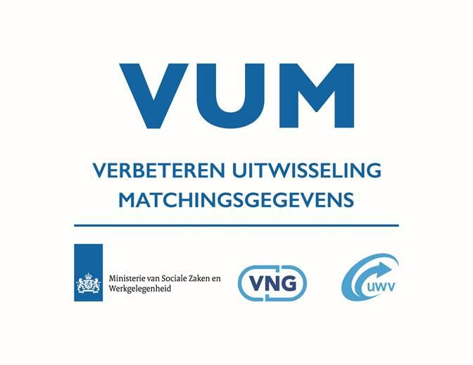
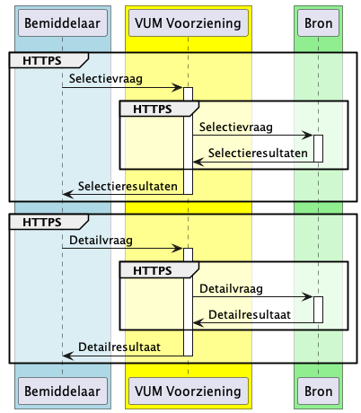

**Inhoud**

[Inleiding](#inleiding)

> [Gerelateerde documentatie](#gerelateerde-documentatie)
 
> [Samenhang met standaarden](#samenhang-met-standaarden)
 
> [Versiehistorie](#versiehistorie)

[VUM Koppelvlakspecificaties](#vum-koppelvlakspecificaties)

> [Berichtuitwisseling](#berichtuitwisseling)

> [Berichtinhoud](#berichtinhoud)

>> [JSON weergave van de VUM Gegevensstandaard](#json-weergave-gegevens)

>> [JSON weergave van de selectievraag](#json-weergave-selectie)

# <a name=inleiding>Inleiding</a>

Dit document bevat een toelichting op de VUM Koppelvlak specificaties. De VUM Koppelvlak specificaties zijn vastgelegd in vier OpenAPI 3.0.0 documenten. Elk van deze documenten beschrijft twee koppelvlakken.

*  VUM-Bemiddelaar-WerkzoekendeProfielen:
	*  Koppelvlak met de VUM Uitwisselingsvoorziening voor selecteren van werkzoekendenprofielen
	*  Koppelvlak met de VUM Uitwisselingsvoorziening voor het opvragen van een detailprofiel van een werkzoekende
* VUM-Bron-WerkzoekendeProfielen:
	* Koppelvlak met een VUM bron voor het selecteren van werkzoekendenprofielen
	* Koppelvlak met een VUM bron voor het opvragen van een detailprofiel van een werkzoekende
*  VUM-Bemiddelaar-Vacatures:
	*  Koppelvlak met de VUM Uitwisselingsvoorziening voor selecteren van vacatures
	*  Koppelvlak met de VUM Uitwisselingsvoorziening voor het opvragen van een detail weergave van een vacature
* VUM-Bron-Vacatures:
	* Koppelvlak met een VUM bron voor het selecteren van vacatures
	* Koppelvlak met een VUM bron voor het opvragen van een detail weergave van een vacature

Deze bestanden zijn in YAML en in JSON formaat beschikbaar en specificeren enkel de technische invulling van de VUM koppelvlakken als web-services. De procesmatige voorwaarden voor het aansluiten op en het gebruik van deze koppelvlakken worden binnen het VUM Afsprakenstelsel met deelnemers overeengekomen. Dit betreft ook de geldende limieten zoals het maximum aantal selectieresultaten en het maximum aantal detailvragen per selectievraag.

## <a name=gerelateerde-documentatie>Gerelateerde documentatie</a>

De specificatie van de VUM koppelvlakken is mede gebaseerd op de volgende
documentatie:

| **Document**                         | **Versie** | **Eigenaar** | **Toelichting**                                                   |
|--------------------------------------|------------|--------------|-------------------------------------------------------------------|
| VUM Solution beschrijving    | 1.0        | VUM          | Functionele beschrijving vanuit het perspectief van aangesloten organisaties                                  |
| Entiteiten en attributen v0.8.4.xlsx Het uniforme werkzoekende profiel De uniforme vacature-standaard | 0.8.4 1.1.0 1.1.0      | VUM          | De VUM Gegevensstandaard                                          |
| VUM Keten Architectuur               | 1.3        | VUM          | Keten Architectuur                                          |
 
Voor meer informatie over deze documenten wordt verwezen naar de website van [VUM] (https://www.matchingsgegevens.nl).

## <a name=samenhang-met-standaarden>Samenhang met standaarden</a>

| **Standaard**                                                                                                                                                  | **Versie** | **Toelichting** |
|----------------------------------------------------------------------------------------------------------------------------------------------------------------|------------|-----------------|
| [<u>API Strategie Algemeen (Nederlandse API Strategie I)</u>](https://docs.geostandaarden.nl/api/API-Strategie/#api-designrules-nederlandse-api-strategie-iia) | 4-feb-2020 |                 |
| [<u>REST-API Design Rules (Nederlandse API Strategie IIa) 1.0</u>](https://publicatie.centrumvoorstandaarden.nl/api/adr/)                                      | 1.0        |                 |
| [<u>OpenAPI specification</u>](https://swagger.io/specification/)                                                                                              | 3.0        |                 |
                                                                                                                                                              
## <a name=versiehistorie>Versiehistorie</a>

| **Versie**  | **Datum**     | **Toelichting**                                                   |
|-------------|---------------|-------------------------------------------------------------------|
| 2.0.0       | 9 april 2024  | Volledig herschreven voor versie 2.0.0                              |

# <a name=vum-koppelvlakspecificaties>VUM Koppelvlakspecificaties</a>

De VUM Koppelvlak specificaties in de OpenAPI bestanden beschrijven twee aspecten van de koppelvlakken:

* De berichtuitwisseling in de vorm van HTTP requests en HTTP responses over een HTTPS verbinding
* De weergave van gegevens in de inhoud van de berichten

## <a name=berichtuitwisseling>Berichtuitwisseling</a>

De berichtuitwisseling op elk van de koppelvlakken bestaat uit een enkelvoudige dialoog van een HTTP request en een HTTP response.
Een selectievraag is een HTTP POST request en het opvragen van een detailprofiel of vacature is een GET request. De responses voor de afhandeling van foutieve situaties zijn ook in koppelvlakspecificaties beschreven.

Vraagstellende bemiddelaars sturen een POST bericht met daarin een selectievraag. Als antwoord ontvangt de vraagsteller een willekeurig geordende 
lijst met selectieresultaten. Deze kunnen dan worden beoordeeld en geordend door de bemiddelaar. Elk selectieresultaat bevat een identificatie 
in de vorm van de JSON property `vumID`. Met deze identificatie kunnen, voor de best beoordeelde selectieresultaten, de detailgegevens worden opgevraagd.

Het opvragen van de detailgegevens bestaat uit een GET request waarbij de `vumID` uit het betreffende selectieresultaat in de URL wordt vermeld. De
response bevat als inhoud de JSON weergave van het detailprofiel of de vacature.

De berichtuitwisseling vindt altijd plaats over een HTTPS verbinding waarbij de server en de client elkaar wederzijds met een PKI Overheid certificaat authenticeren.
Dit certificaat bevat het Organisatie Identificatienummer (OIN) van de eigenaar van het certificaat.

Specifiek voor VUM zijn enkele HTTP header velden toegevoegd aan de berichten voor het identificeren van afzenders en ontvangers, waarbij deze worden aangeduid met hun OIN.
In deze HTTP headers wordt een onderscheid gemaakt tussen de organisatie die de verwerkingsverantwoordelijke is bij het versturen of ontvangen van een request op het koppelvlak met de VUM Uitwisselingsvoorziening (bijv. de betreffende gemeente) en de organisatie die de verwerker is (bijv. de techpartner). Als de verwerkingsverantwoordelijke geen gebruik maakt van een verwerker, dan wordt de OIN van de verwerkingsverantwoordelijke zelf ingevuld bij headers die de verwerker aangegeven (de verwerkingsverantwoordelijke is dan ook de verwerker met betrekking tot het invullen van de headers).

Het Inlichtingenbureau (IB) treedt in de VUM keten met de VUM Uitwisselingsvoorziening op als verwerker.

De invulling van deze velden is als volgt:

| **Koppelvlak**      | **Bericht** |**Header**       | **Invulling**                                                         |
|---------------------|-------------|-----------------|-----------------------------------------------------------------------|
| Bemiddelaar &#8594; VUM  | POST        | X-VUM-toParty   | OIN van het IB                                                        |
|                     |             | X-VUM-fromParty | OIN van de vraagstellende verwerkingsverantwoordelijke                |
|                     |             | X-VUM-viaParty  | OIN van de vraagstellende verwerker                                   |
| Bemiddelaar &#8592; VUM  | response    | X-VUM-toParty   | OIN van de vraagstellende verwerkingsverantwoordelijke                |
|                     |             | X-VUM-fromParty | OIN van het IB                                                        |
|                     |             | X-VUM-viaParty  | OIN van de vraagstellende verwerker                                   |
| VUM &#8594; Bron         | GET         | X-VUM-toParty   | OIN van de antwoordende verwerkingsverantwoordelijke                  |
|                     |             | X-VUM-fromParty | OIN van de vraagstellende verwerkingsverantwoordelijke                |
|                     |             | X-VUM-viaParty  | OIN van de antwoordende verwerker                                     |
|                     |             | X-VUM-SUWIParty | De vraagstellende verwerkingsverantwoordelijke neemt deel aan SUWI    |
| VUM &#8592; Bron         | response    | X-VUM-toParty   | OIN van de vraagstellende verwerkingsverantwoordelijke                |
|                     |             | X-VUM-fromParty | OIN van de beantwoordende verwerkingsverantwoordelijke                |
|                     |             | X-VUM-viaParty  | OIN van de vraagstellende verwerker                                   |

## <a name=berichtinhoud>Berichtinhoud</a>

De inhoud van de berichten is een weergave in JSON van de selectievraag en van de gegevens in de selectie- en detailresultaten. Deze weergave is gespecificeerd met JSON schema's in de VUM Koppelvlakspecificaties.

De basis van de inhoud van de berichten is de weergave van de gegevens van de VUM Gegevenstandaard in JSON:

* detailresultaten bevatten de JSON weergave van de gegevens van de VUM Gegevensstandaard
* selectieresultaten bevatten de JSON weergave van de opvraagbare gegevens van de VUM Gegevensstandaard
* selectievragen bevatten een query die JSON weergaves van opvraagbare gegevens selecteert. De query zelf is een JSON object

### <a name=json-weergave-gegevens>JSON weergave van de VUM Gegevensstandaard</a>

De JSON weergave van de gegevens van de VUM Gegevensstandaard wordt weergegeven door de JSON schema's in de koppelvlak specificaties 
Deze schema's zijn op de volgende wijze opgesteld:

* Samengestelde gegevens worden weergegeven als JSON objecten waarbij elk deelgegeven als een JSON property wordt weergegeven
* De naamgeving van JSON properties is een een afbeelding van de naam in de VUM Gegevensstandaard, in een vorm die geschikt is als JSON naam:
	* Afzonderlijke woorden na een spatie krijgen een hoofdletter als eerste karakter en spaties zijn verwijderd
	* Bijzondere tekens zijn verwijderd of omgezet naar een gelijkend ASCII teken
* Lege waardes (arrays, objecten en strings) zijn niet toegestaan in de VUM Gegegevensstandaard. Deze worden niet expliciet uitgesloten in de JSON weergave maar JSON properties met een lege waarde moeten als afwezig worden beschouwd.
* Verzamelingen van gegevens worden weergegeven als een JSON array

Bij het laatste punt moet worden opgemerkt dat de VUM Gegevensstandaard geen lijsten met een volgorde kent. De volgorde van gegevens in 
een JSON array moet daarom binnen de context van VUM worden genegeerd.

Daarnaast kent de VUM Gegevensstandaard een aantal waardelijsten. Sommige waardelijsten betreffen een beperkt aantal codes die binnen de 
VUM Gegegevensstandaard worden beheerd. Deze zijn als enumeratie van mogelijke waardes voor het gegeven in het JSON schema opgenomen.

Daarnaast bevat de VUM Gegevensstandaard ook een aantal waardelijsten die door andere organisaties worden beheerd. Dit betreft onder
andere de lijsten van opleidingen, beroepen, landen en talen. Deze waardelijsten zijn niet opgenomen als enumeratie. Het schema bevat dan wel een restrictie die de vorm van het gegeven beschrijft (bijv. een taalcode bestaat uit drie alfabetische karakters).

Tot slot zijn er, als uitzondering, een aantal extern beheerde waardelijsten met een zeer beperkt aantal keuzes volledig als enumeratie
opgenomen. Dit betreft bijvoorbeeld de codes voor verschillende soorten rijbewijzen.

Voor het overzicht van de waardelijsten wordt verwezen naar de [VUM Gegegensstandaard] (https://www.matchingsgegevens.nl).

Als laatste wordt opgemerkt dat het type van een gegeven in de VUM Gegevensstandaard niet altijd overeenkomt met het JSON type waarmee dat gegeven wordt weergegeven. Een specifiek voorbeeld zijn datums. In de JSON weergave zijn dat strings volgens het JSON "date" format. In de VUM Gegegevensstandaard worden datums weergegeven met integers. Daarnaast zijn ook enkele gegevens die een codering weergeven, als strings opgenomen in de koppelvlakken terwijl het integers zijn in de VUM Gegevensstandaard. In alle gevallen moet op de koppelvlakken de weergave worden gevolgd die aangegeven is in de VUM Koppelvlakspecificaties.

### <a name=json-weergave-selectie>JSON weergave van de selectievraag</a>

De specificatie van de selectievraag beschrijft welke gegevens bevraagd kunnen worden en welke expressies en operatoren daarbij kunnen worden gebruikt.
Dit is beschreven in de vorm van een JSON schema. De query taal van MongoDB is gekozen als overkoepelend kader om specifieke versies van de selectievraag 
te beschrijven. Hierbij worden de volgende uitgangspunten gehanteerd:

* Operatoren worden altijd expliciet vermeld
* Enkel de ondersteunde combinaties van gegevens en operatoren worden in een specifieke versie van het JSON schema van de selectievraag beschreven
* Niet-beschreven combinaties van gegevens en operatoren worden dan niet uitgesloten op het koppelvlak, maar hebben ook geen effect op het uitvoeren van de selectie bij de bron
* Het verplichte gegeven `selectiegebied` met daarin een postcode en afstand is een bewuste afwijking van de MongoDB query taal. Dit is ook de enige afwijking.

JSON schema's kunnen zodanig worden geformuleerd dat niet beschreven operatoren en gegevens door dat schema worden toegestaan. Hier wordt gebruik van gemaakt
in de specificatie van de selectievraag en dit maakt het mogelijk om wijzigingen op de koppelvlakken door te voeren zonder dat alle partijen in de 
keten tegelijk over moeten gaan naar de nieuwe versie.

Gedurende de overgangsperiode tussen twee versies kan het dan voorkomen dat niet alle selectiecriteria in een specifieke selectievraag door alle bronnen worden gehonoreerd. Bronnen zullen de criteria die buiten de door hun ondersteunde versie van de selectievraag vallen, niet toepassen en dit kan resultaten opleveren die anders door die selectiecriteria uitgesloten zouden worden. Een vraagsteller ontvangt dan mogelijk resultaten die niet aan alle selectiecriteria in de gestelde selectievraag voldoen. Mocht dit ongewenst zijn, dan kan de vraagsteller gedurende de overgangsperiode de ongewenste resultaten uitfilteren door deze selectiecriteria lokaal toe te passen op de ontvangen resultaten.
