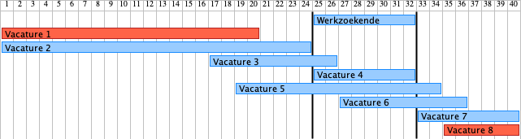

# Releasenotes VUM Koppelvlak specificaties v2.0.0

Deze versie van de VUM Koppelvlak specificaties is gebaseerd op versie 1.4 van de VUM Gegevensstandaard.

Versie 2.0.0 van de VUM Koppelvlak specificaties introduceert twee significante wijzigingen ten opzichte van de voorgaande 1.2.0 release:

* De zoekvraag van versie 1.2.0 is vervangen door de selectievraag in versie 2.0.0. De selectievraag neemt het JSON query formaat van MongoDB als kader en maakt gebruik van expliciete operatoren waarmee de gewenste selectie eenduidig uitgedrukt kan worden door de vraagstellende bemiddelaar. 
* De selectieresultaten worden vanaf versie 2.0.0 opgeleverd in het response bericht van de selectiedialoog. In versie 1.2.0 en daarvoor werden de zoekvraagresultaten asynchroon naar een callback server opgeleverd.

Daarnaast zijn in versie 2.0.0 de openstaande aandachtspunten opgelost met betrekking tot de weergave van de VUM Gegevensstandaard versie 1.4 in JSON objecten. Dit betreft de volgende punten:

* De HTTP-header "API-VERSION" is verplicht in alle berichten en heeft voor deze release de constante waarde "2.0.0"
* De HTTP-header "X-VUM-ViaParty" is verplicht in alle berichten
* De naam van het attribuut "mpOpleidingsnaam" in de selectieresultaten voor vacatures is veranderd naar "opleidingsnaam" en is daarmee gelijk gemaakt aan de naam in de detailresultaten voor vacatures
* De naam van het attribuut "sluitingsDatumVacature" in selectie- en detailresultaten voor vacatures is veranderd in "sluitingsdatumVacature" en voldoet daarmee aan de gehanteerde naamgevingsconventie voor attribuutnamen
* De waarde van het attribuut "codeBeroepsnaam" is ingeperkt tot een string van 1 tot maximaal 10 numerieke karakters (0-9) in overeenstemming met de externe waardelijst
* De waarde van het attribuut "codeWebadres" is ingeperkt tot de waardes "1", "2", "3" en "4" in overeenstemming met de VUM Gegevensstandaard
* De waarde van het attribuut "codeTaal" is beperkt tot een string van 3 alfabetische "lowercase" karakters, in overeenstemming met de externe waardelijst
* De ongedefinieerde specificatie "URL" voor het attribuut "url" is veranderd naar de standaard JSON Schema specificatie "url"

De nieuwe selectievraag en de synchrone beantwoording van de selectievraag zijn "breaking changes" ten opzichte van de voorgaande versie en leiden tot een ophoging van het major versienummmer. De releasenotes van de voorgaande 1.x.x versies zijn met deze wijzigingen verminderd relevant en zijn daarom niet meer in dit document opgenomen.

## Toelichting bij de selectie op het aantal werkuren per week

De selectie op het aantal werkuren per week bevraagt de gegevenselementen "AantalWerkurenPerWeekMaximaal" en "AantalWerkurenPerWeekMinimaal". Dit vereist dat de selectievraag de juiste condities formuleert voor deze waardes in de resultaten die worden geselecteerd. Deze waardes zijn gebaseerd op het bereik van het aantal werkuren waarmee een overlap moet bestaan in de geselecteerde resultaten. 

Het onderstaande diagram geeft als voorbeeld de selectie op een overlap tussen het gewenste aantal werkuren van een werkzoekende en de werkuren van de aangeboden vacatures:

De condities in de selectievraag moeten dan zodanig worden geformuleerd dat de met rood aangegeven vacatures niet worden geselecteerd, en de met blauw aangegeven vacatures wel. 

Dit wordt op de volgende manier bereikt:

* Het maximum van het geboden bereik moet groter of gelijk zijn aan het minimum van een gewenste bereik:
 Als niet aan deze conditie wordt voldaan, dan eindigt het geboden bereik voordat het gewenste bereik begint (Vacature 1 in het diagram). Dit betekent dat elk resultaat waarmee er een overlap is, altijd aan deze conditie voldoet.

* Het minimum van het geboden bereik moet kleiner of gelijk zijn aan het maximum van het gewenste bereik:
 Als niet aan deze conditie wordt voldaan, dan begint het geboden bereik nadat het gewenste bereik eindigt (Vacature 8 in het diagram). Dit betekent dat elk resultaat waarmee er een overlap is, altijd aan deze conditie voldoet.

Merk op dat Vacature 8 in het diagram wel aan de eerste conditie voldoet, maar niet aan de tweede. Voor Vacature 1 is dat net andersom. Samen selecteren deze condities dan enkel de gevallen waarbij er een overlap is.

Er kunnen gevallen zijn waarbij er geen gewenst minimum of maximum is opgegeven. Als er geen gewenst minimum is, dan is er geen begin aan het gewenste bereik en is er altijd een overlap als aan de tweede conditie wordt voldaan (het geboden bereik begint voor het einde van het gewenste bereik). Andersom geldt ook dat als er geen gewenst maximum is, dan is er altijd een overlap als aan de eerste conditie wordt voldaan.

Dit betekent dat bij het selecteren op het gegeven "aantalWerkUrenPerWeekMaximaal" gebruik wordt gemaakt van de $gte operator en dat daarbij de minimale waarde van het gewenste bereik moet worden opgegeven. Voor "aantalWerkUrenPerWeekMinimaal" wordt gebruik gemaakt van de $lte operator en wordt het maximum van het gewenste bereik opgegeven.

## Toekomstige wijzigingen in de VUM Gegevensstandaard

Op het moment van deze release zijn er ontwikkelingen in de VUM Gegevensstandaard die tot versie 1.5 van deze standaard zullen leiden. Hierbij zullen een aantal gegevenselementen naar verwachting verwijderd worden. Nieuwe implementaties van bronnen wordt geadviseerd om deze gegevens niet op te nemen in de uitgaande selectie- en detailresultaten. Ontvangende bemiddelaars moeten deze gegevens echter wel accepteren als deze aanwezig zijn in de ontvangen resultaten. Zij kunnen er wel voor kiezen om deze gegevens bij ontvangst te negeren en niet in achterliggende systemen te verwerken.

De volgende gegevenselementen worden dan als "deprecated" aangemerkt:

* Werkgeveradressen in vacatureresultaten met de functiecodes "B" (briefadres), "W" (woonadres), "L" (loonaaangifteadres) en "A" (Afwijkend adres)
* Begin- en einddatums voor werkgeveradressen in vacatureresultaten
* Het gegevenselement "omschrijving gedragscompetentie" in de entiteit "Gedragscompetentie"
* Het gegevenselement "code beheersing gedragscompetentie" in de entiteit "Gedragscompetentie"
* Het gegevenselement "omschrijving opleiding" in de entiteit "Opleidingsnaam Ongecodeerd"
* Het gegevenselement "omschrijving opleidingsnaam" in de entiteit "Opleidingsnaam Gecodeerd"
* Het gegevenselement "omschrijving beroepsnaam" in de entiteit "Beroepsnaam Gecodeerd"

## Toekomstige wijzigingen in de selectievraag

De specificatie van de selectievraag is zodanig opgesteld dat toekomstige toevoegingen niet worden uitgesloten. Dit is mogelijk omdat JSON schemas zodanig kunnen worden geformuleerd dat niet-benoemde gegevens en operatoren worden toegestaan op het koppelvlak. Bij de verwerking van de selectievraag zullen deze niet-benoemde gegevens en operatoren genegeerd worden. Hiermee wordt het mogelijk om gedurende een overgangsperiode twee verschillende versies van de selectievraag gelijktijdig in de VUM keten te ondersteunen: 

* De koppelvlak specificaties staan toe dat onbenoemde gegevens en operatoren voorkomen in de selectievraag: 
	* toegevoegde gegevens en operatoren worden dan geaccepteerd op een koppelvlak van de voorgaande versie
	* verwijderde gegevens en operatoren die toch aanwezig zijn, worden dan niet geweigerd op een koppelvlak van de nieuwe versie

* De ontvangende systemen verwerken de gegevens en operatoren van de ontvangen selectievraag die binnen de door hun ondersteunde versie van de selectievraag vallen. De selectiecriteria in de selectievraag die buiten de ondersteunde versie vallen worden genegeerd.

Gedurende de overgangsperiode tussen twee versies kan het voorkomen dat niet alle selectiecriteria in een specifieke selectievraag door alle bronnen worden gehonoreerd. Bronnen zullen de criteria die buiten de door hun ondersteunde versie van de selectievraag vallen, niet toepassen en dit kan resultaten opleveren die anders door die selectiecriteria uitgesloten zouden worden. Een vraagsteller ontvangt dan mogelijk resultaten die niet aan alle selectiecriteria in de gestelde selectievraag voldoen. Mocht dit ongewenst zijn, dan kan de vraagsteller gedurende de overgangsperiode de ongewenste resultaten uitfilteren door deze selectiecriteria lokaal toe te passen op de ontvangen resultaten.

